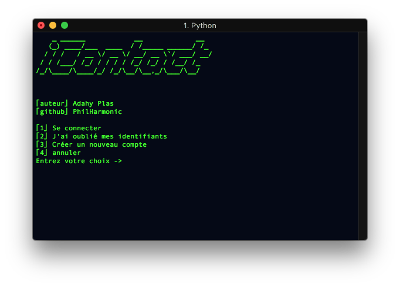

# _iContacts_ 

Auteur : Adahy Plas

Github : [PhilArmonic](https://github.com/PhilArmonic)

Instagram : [adahy.plas](https://www.instagram.com/adahy.plas)

lien repo : [https://github.com/PhilArmonic/Contacts](https://github.com/PhilArmonic/Contacts)


----------

1. ## Qu'est ce que c'est ?

   1. _iContacts_ est un gestionnaire de contacts en ligne de commande programmé en [python](https://www.python.org) et en [MariaDB](https://mariadb.org/)

2. ## installation.

   1. ```bash
      git clone https://github.com/PhilArmonic/Contacts.git
      cd Contacts
      python3 install.py #rien ne se passe dans le shell, mais maintenant il y a un fichier database.db
      ```

3. ## Utilisation.

   1. ###  commandes

      1. **/exit** -> pour quitter le programme
      2. **/add** -> pour ajouter un contact
      3. **/delete** -> pour supprimer un contact
      4. **/list** -> pour afficher tout  **<u>VOS</u>** contacts
      5. **/help** -> pour obtenir de l'aide
      6. **/sendKey** -> pour envoyer votre clé, je l'explique plus-bas
      7. **/export** -> pour exporter un contact
      8. **/update** -> pour modifier un contact
      9. **/listAll** -> pour afficher toutes le données qui sont enregistrées dans las base de donnée
      10. **/view** -> pour afficher les informations d'un de **<u>VOS</u>** contact

   2. ### Démarrer le programme

      1. `python3 main.py`

      2. 

      3. Si c'est la première fois que vous ouvrez le programme tapez 3

         1. Ensuite entrez votre prénom
         2. Votre nom de famille
         3. Votre adresse mail
         4. et un mot de passe
         5. Réentrez le mot de passe que vous venez d'écrire
         6. vous clé s'affiche à l'écran notez là quelque part pour ne pas la perdre. elle ne peut pas être changée.
         7. Bravo ! Vous venez de créer votre compte

         ---------------

      4. Si vous avez déjà un compte tapez 1

         1. Entrez votre adresse mail
         2. Entrez votre clé d'identification
         3. Vous-êtes maintenant connecté à la base de données vous pouvez utiliser les commandes citées au dessus

         --------------

      5. Si vous avez oublié votre mot de passe tapez 2

         1. Entrez votre adresse mail
         2. Entrez un nouveau mot de passe
         3. Réentrez votre nouveau mot de passe

      6. Le 4 quitte le programme

   3. ### Utiliser les commandes

      1. **/exit** termine le programme
      2. **/add**
         1. Entrez le prénom de votre nouveau contact
         2. Ensuite le nom du contact
         3. Sa date de naissance
         4. Son numéro de téléphone
         5. Son adresse mail
         6. Et une description (non-obligatoire comme tout le reste, de dans vous pouvez mettre sa profession, sa seconde adresse mail,…)
      3. **/list**
         1. Structure
            1. [numéro de la place dans la base] -> [Pénom] [Nom] [date de naissance] [Numéro de téléphone] [Adresse mail] [description]
         2. affiche tout les contacts
      4. **/delete**
         1. Entrez le numéro de la place dans la base de votre contact
         2. Si c'est la bonne personne qui est affichée écrivez "y"
            1. Ensuite entrez votre mot de passe
         3. Si ce n'est pas la bonne personne écrivez "n"
      5. **/sendKey**
         1. Sert à envoyer sa clé d'indentification cryptée. (vous verrez à quoi ça sert plus tard)
      6. **/export**
         1. utilité
            1. vous ne voyez peut-être pas d'utilité a exporter un contact mais bon. ça peut quand même servir.
            2. Si vous voulez exporter votre contact pour le sauvegarder suivez ces options:
               1. Écrivez **/SendKey**
                  1. vous obtenez une suite de chiffres et de lettres de 128 caractères. Copiez là dans votre presse papier
               2. Ensuite écrivez **/export**
                  1. Vous avez deux choix ->
                     1. Soit vous exportez un contact existant
                        1. Copiez collez la clé
                        2. et entrez la place de votre contact dans la base de donnée
                     2. Soit vous exportez un contact inexistant.
                        1. Entrez le prénom de votre contact
                        2. Entrez son nom
                        3. Sa date de naissance
                        4. Son numéro de téléphone
                        5. Son adresse mail
                        6. Sa description (toujours pas obligatoire)
                  2. Un fichier ToSend.py c'est créé pour ajouter le contact dans la base de donnée écrivez `python3 ToSend.py` .
                  3. Et votre contact c'est ajouté dans la base de donnée vous pouvez maintenant supprimer le fichier ToSend.py
            3. Si vous voulez envoyer un contact à un autre personne vous avez besion de sa clé cryptée. Donc demander la lui
               1. Ensuite ce sont les mêmes étapes qu'au dessus sauf que vous lui envoyer le fichier ToSend.py et que c'est lui qui doit executer `python3 ToSend.py`
      7. **/update**
         1. en construction
      8. **/listALL**
         1. en construction
      9. **/view**
         1. Entrez le numéro de la place dans la base de votre contact
         2. Et ses informations s'affichent

4. ## Mot de fin.

   1. Si vous avez des questions contactez moi à cette [adresse](mailto:adahy.plas@gmail.com?subject=Github%20iContacts%20Questions).
   2. Si vous avez des recommandations contactez-moi à cette [adresse](mailto:adahy.plas@gmail.com?suject=GitHub%20iContacts%20%suggestion).


